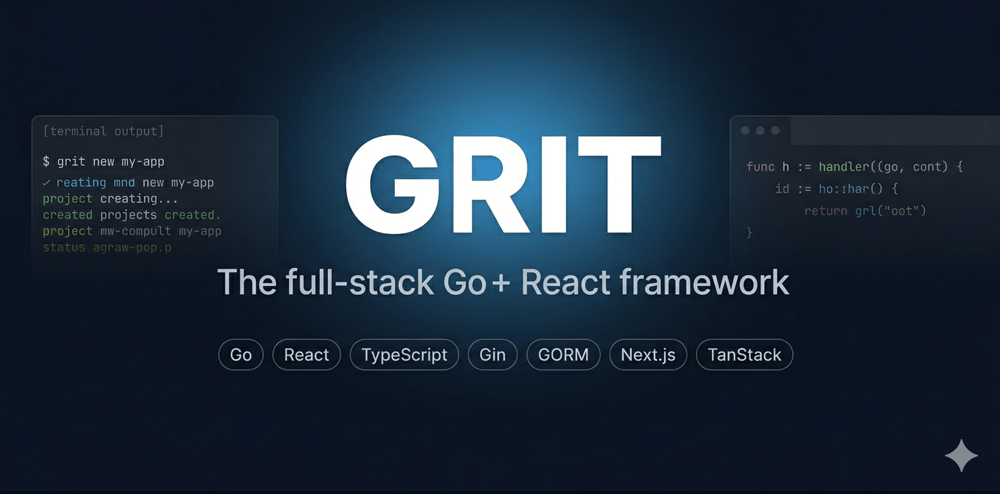
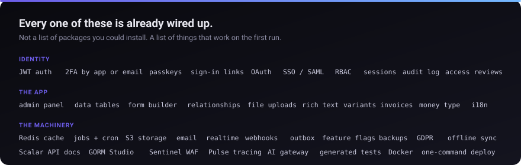

<p align="center">
  
</p>

<h1 align="center">Grit</h1>

<p align="center">
  <strong>Go + React. Built with Grit.</strong><br />
  Describe a resource. Get the Go model, the API, the migrations, the TypeScript types,
  the React hooks and the admin screen. Auth, jobs, storage and deploy are already there.
</p>

<p align="center">
  <a href="https://github.com/MUKE-coder/grit/releases"></a>
  <a href="https://github.com/MUKE-coder/grit/actions/workflows/ci.yml"></a>
  <a href="https://github.com/MUKE-coder/grit/actions/workflows/live.yml"></a>
  <a href="https://github.com/MUKE-coder/grit/actions/workflows/scan.yml"></a>
  <a href="https://github.com/MUKE-coder/grit/blob/main/LICENSE"></a>
  <a href="https://gritframework.dev"></a>
</p>

<p align="center">
  <a href="#install"><strong>Install</strong></a> ·
  <a href="#build-something-real-in-five-minutes"><strong>5-minute tutorial</strong></a> ·
  <a href="#let-an-ai-build-it"><strong>Build with AI</strong></a> ·
  <a href="https://gritframework.dev/docs"><strong>Docs</strong></a>
</p>

---

## Install

```bash
curl -fsSL https://gritframework.dev/install.sh | sh        # macOS, Linux, Git Bash
```

```powershell
irm https://gritframework.dev/install.ps1 | iex             # Windows PowerShell
```

No Go toolchain needed. `grit version` to check, `grit update` to self-update.

<details>
<summary>Other ways to install</summary>

```bash
go install github.com/MUKE-coder/grit/v3/cmd/grit@latest    # with a Go toolchain
GRIT_VERSION=v3.320.0 curl -fsSL https://gritframework.dev/install.sh | sh   # pin a release
```

You need Go 1.21+, Node 20+, pnpm, and Docker for Postgres, Redis, MinIO and Mailhog.
[Full prerequisites](https://gritframework.dev/docs/prerequisites)

</details>

## Sixty seconds

```bash
grit new myapp --triple --next   # Web + Admin + API
cd myapp
docker compose up -d             # Postgres, Redis, MinIO, Mailhog
pnpm install
grit start
```

Open http://localhost:3000, register, and you are logged into an application that already
has authentication, two-factor, an admin panel, a database browser and API docs.

<p align="center">
  
</p>

---

## What ships in every project

<p align="center">
  
</p>

<table>
<tr>
<td width="50%"><br /><sub><b>Auth UI.</b> Sign in, register, reset, verify, 2FA.</sub></td>
<td width="50%"><br /><sub><b>Forms.</b> Built from your field definitions, pickers included.</sub></td>
</tr>
<tr>
<td width="50%"><br /><sub><b>Roles and permissions.</b> Per resource, from one command.</sub></td>
<td width="50%"><br /><sub><b>Line items and money.</b> Integer minor units, never floats.</sub></td>
</tr>
<tr>
<td width="50%"><br /><sub><b>Jobs, cron, mail.</b> With a dashboard, not just a queue.</sub></td>
<td width="50%"><br /><sub><b>API docs.</b> Generated from the routes, always current.</sub></td>
</tr>
<tr>
<td width="50%"><br /><sub><b>Every resource gets this.</b> Sort, filter, search, page, import, export.</sub></td>
<td width="50%"><br /><sub><b>One account screen.</b> Password, 2FA, passkeys, sign-in links, devices.</sub></td>
</tr>
</table>

One API, every client: [web](https://gritframework.dev/docs/frontend/web-app) ·
[admin](https://gritframework.dev/docs/admin/overview) ·
[mobile (Expo)](https://gritframework.dev/docs/mobile/getting-started) ·
[desktop (Wails)](https://gritframework.dev/docs/desktop/getting-started)

---

## Build something real in five minutes

A support desk with customers, tickets, a filterable table, a form with a customer picker,
a REST API and fifty rows of realistic data.

**1. Scaffold and start the infrastructure.**

```bash
grit new helpdesk --triple --next
cd helpdesk
docker compose up -d
pnpm install
```

**2. Model the domain.** One command per noun. The field types decide the database column,
the validation, the TypeScript type and the admin input, all at once.

```bash
grit generate resource Customer --fields "name:string,email:email,company:string:optional"

grit generate resource Ticket --fields "subject:string,body:richtext,priority:select:low=Low|normal=Normal|high=High,status:select:open=Open|closed=Closed,customer:belongs_to:Customer" --seed --faker --count 50
```

Each of those writes nine files and injects the wiring: a GORM model, a service, a handler,
the routes, a Zod schema shared by every frontend, TypeScript types, React Query hooks, an
admin page and its resource definition.

**3. Migrate, seed and run.**

```bash
grit migrate
grit seed
grit start
```

**4. Look at what you have.** At http://localhost:3001 there is a Tickets screen with
sorting, filtering, search, pagination and bulk selection; a create form with a rich-text
editor, two dropdowns and a searchable customer picker; and full CRUD behind role guards.
At http://localhost:8080/docs is the API reference for the endpoints that back it, and at
`/studio` a browser for the rows themselves.

**5. Add a column later**, without regenerating. It goes into the model, both Zod schemas,
the TypeScript type, the admin form and the table, and GORM adds the column on the next
`grit migrate`:

```bash
grit generate field Ticket resolved_at:datetime
```

Scalar, select and toggle columns work this way. For a relationship, file, slug or array
field, regenerate the resource.

**6. Ship it.**

```bash
grit deploy --host you@server.com --domain helpdesk.com
```

SSH, systemd and Caddy with automatic TLS.
[Deployment guides](https://gritframework.dev/docs/deployment) for Railway, Render, Fly.io,
Coolify, Dokploy and plain VPS.

> Longer walkthroughs: [a CRM](https://gritframework.dev/blog/build-a-crm-with-grit) ·
> [a storefront](https://gritframework.dev/blog/build-a-storefront-with-grit) ·
> [an invoice app](https://gritframework.dev/blog/build-an-invoice-app-with-grit) ·
> [a mobile app](https://gritframework.dev/blog/build-mobile-app-with-grit) ·
> [a desktop app](https://gritframework.dev/blog/build-desktop-app-with-grit)

---

## Let an AI build it

Grit is a code generator, and agents that do not know that hand-write the nine files and
wonder why nothing is reachable. So there is a skill that teaches them:

```bash
npx skills add MUKE-coder/grit --skill grit
```

Then paste the build prompt, which sets out the whole job in nine steps, links every
concept the agent needs, and tells it to ask you what you are building before it scaffolds
anything:

```bash
curl -s https://gritframework.dev/prompt
```

Or copy it from [gritframework.dev/docs/ai-integration](https://gritframework.dev/docs/ai-integration),
which also has a wizard that narrows the brief to your stack and plugins. The skill itself
is readable at [gritframework.dev/skill.md](https://gritframework.dev/skill.md), and there
is an [MCP server](https://gritframework.dev/docs/ai-workflows/mcp) for tools that speak it.

---

## Choose an architecture

| Mode | Command | What you get |
|---|---|---|
| **Triple** | `grit new app --triple` | Web + Admin + API, Turborepo monorepo |
| **Double** | `grit new app --double` | Web + API, no separate admin |
| **Single** | `grit new app --single` | One Go binary, SPA embedded with `go:embed` |
| **API** | `grit new app --api` | Go API only |
| **Mobile** | `grit new app --mobile` | API + Expo React Native |
| **Desktop** | `grit new-desktop app` | Wails + Go + React + SQLite |

Frontend: `--next` (App Router, default) or `--vite` (TanStack Router, SPA).
Database: `--db postgres|mysql|sqlite|memory`.
`grit new .` scaffolds into the current directory.

[Architecture guide](https://gritframework.dev/docs/concepts/architecture-modes)

## Field types

The field definition is the source of truth for the column, the validation, the type and
the admin input.

| Type | Go | Notes |
|---|---|---|
| `string` `text` `richtext` | `string` | required by default; `richtext` gets a Tiptap editor |
| `int` `uint` `float` | `int` `uint` `float64` | `float` for weights and ratings, never money |
| `bool` / `toggle` | `bool` | |
| `date` `datetime` `time` | `*time.Time` | |
| `money` | minor units + currency | **use this for money** |
| `email` `url` `domain` `tel` `country` `color` `percent` `rating` | `string` / number | checked and normalised on write; `tel:UG` sets a default country |
| `slug` | `string` | auto-unique from another field |
| `select` `radio` `check` | `string` / JSON | `status:select:draft=Draft\|paid=Paid` |
| `file` `files` | `FileRef` | S3-backed; `file:image` limits what is accepted |
| `json` `string_array` | JSON column | |
| `belongs_to` `one_to_one` | `string` | a UUID foreign key plus an index |
| `many_to_many` | `[]string` | junction table and a picker |

**Modifiers:** `:unique` `:optional` `:encrypted` `:slug:<source>` `:belongs_to:<Model>`
`:many_to_many:<Model>` `:select:a=A|b=B` `:file:image`

[Full reference](https://gritframework.dev/docs/concepts/field-types)

<details>
<summary><strong>CLI reference</strong></summary>

```bash
# Scaffolding
grit new <name>                        # interactive
grit new <name> --triple --next        # explicit
grit new-desktop <name>                # desktop app (Wails)

# Generating
grit generate resource <Name> --fields "..."   # also: grit g
grit generate resource <Name> --seed --faker --count 500
grit generate field <Resource> <name:type>     # one column, in place
grit generate seeder <Resource>
grit generate form <Resource>                  # multi-step form
grit generate table <Resource>
grit remove resource <Name>                    # reverses every injection
grit add role <ROLE>
grit add variants --resource <Resource>
grit sync                              # Go types -> TypeScript + Zod

# Running
grit start                             # everything
grit start server | grit start client
grit studio                            # GORM Studio
grit routes                            # what is actually mounted
grit doctor                            # audit for silent security mistakes

# Database
grit migrate                           # run migrations
grit migrate --fresh | status | down
grit seed
grit backup | grit restore

# Plugins
grit plugin list | add <name> | remove <name> | update

# Operations
grit down                              # maintenance mode
grit up
grit deploy --host user@server --domain example.com

# Meta
grit version | grit update             # the CLI
grit upgrade                           # this project's templates
```

[Full CLI docs](https://gritframework.dev/docs/cli)

</details>

<details>
<summary><strong>Tech stack</strong></summary>

| Layer | Technology |
|---|---|
| Backend | Go 1.21+ · Gin · GORM |
| Frontend | Next.js 14+ (App Router) **or** TanStack Router (Vite) |
| Styling | Tailwind CSS · shadcn/ui |
| Database | PostgreSQL · MySQL 8+ / MariaDB · SQLite |
| Cache / queue | Redis · asynq |
| Storage | S3-compatible (MinIO, Cloudflare R2, AWS S3) |
| Email | Resend |
| AI | Vercel AI Gateway |
| Auth | JWT · TOTP · passkeys · OAuth2 · SSO (OIDC, SAML) |
| Validation | Zod, shared between apps |
| Data fetching | TanStack Query |
| Monorepo | Turborepo · pnpm |
| Security | Sentinel (WAF, rate limiting) |
| Observability | Pulse (tracing, metrics) |
| DB browser | GORM Studio |
| Desktop / mobile | Wails v2 · Expo |
| Deploy | SSH + systemd + Caddy (auto-TLS) |

</details>

<details>
<summary><strong>Plugins</strong></summary>

Two different things, often confused.

**`grit plugin add` generates code into your project**: models, routes, admin pages and
components, recorded in `.grit/plugins.lock.json` so `grit plugin remove` reverses every
file and injection. You own the result. `grit plugin update` carries a fix into projects
that already installed it.

```bash
grit plugin list
grit plugin add multitenant       # organizations, per-org roles, query scoping
grit plugin add impersonate       # sign in as another user, with an audit trail
grit plugin add command-palette   # ⌘K navigation
grit plugin add saved-views       # per-user named table views
grit plugin add stripe            # checkout, subscriptions, webhooks
grit plugin add push | video | webhooks | device-pairing
```

**The `grit-plugins` Go packages are ordinary modules** you import and wire yourself, and
are *not* installed by `grit plugin add`. They are early (v0.3.0): they build, vet and
carry contract tests, but several still store `user_id` as `uint` while a Grit `User.ID` is
a UUID string. Check core first, since `grit-websockets` duplicates the realtime module a
scaffolded app already ships.

[Plugin docs](https://gritframework.dev/docs/plugins/overview) ·
[repo](https://github.com/MUKE-coder/grit-plugins)

</details>

---

## Documentation

**[gritframework.dev](https://gritframework.dev)** has the guides, the tutorials, the API
reference and the [free 10-part course](https://gritframework.dev/courses).

Start at [/docs/start](https://gritframework.dev/docs/start), which is one ordered route
from nothing to deployed. [What is stable and what is not](https://gritframework.dev/docs/stability).
[Changelog](https://gritframework.dev/docs/changelog).

## Sponsors

Grit is free and MIT licensed. Sponsorship pays for the features, docs and releases
everyone else gets for free, and puts your name in front of every developer who builds
with Grit.

<!-- sponsors:start -->
<p align="center">
  <em>Grit has no sponsors yet. Be the first. Your logo goes here, on the home page, and inside the CLI.</em>
</p>
<!-- sponsors:end -->

<p align="center">
  <a href="https://gritframework.dev/sponsor"><strong>Become a sponsor →</strong></a>
</p>

Building with Grit? Add the badge:

```markdown
[](https://gritframework.dev)
```

## License

MIT
